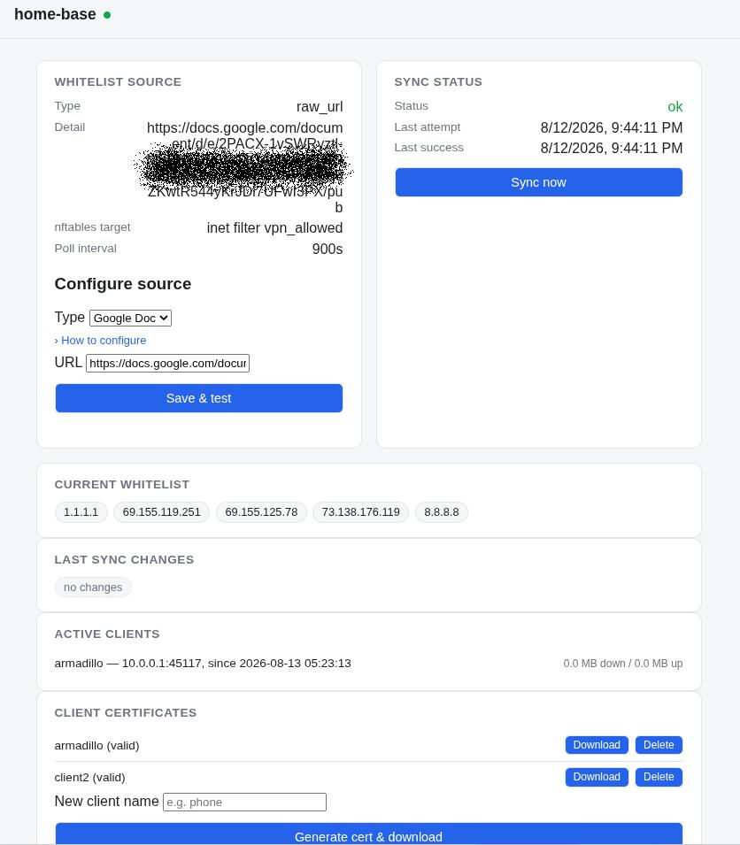

# home-base

Runs a home VPN server -- OpenVPN, WireGuard, or both -- whose access
whitelist you can update from wherever you're traveling, without SSHing in
by hand. Update a doc (a GitHub gist, or any URL that hands back plain
text) with your current public IP, and home-base notices within a poll
cycle and applies it to the firewall, gating whichever VPN backend(s) are
enabled.



For each backend independently, if it already exists on the box, home-base
adopts it as-is (never modifies its config, PKI/keys, or firewall rules
beyond the one whitelist set's membership). If not, and that backend is
enabled, `install.sh` provisions it from scratch: OpenVPN gets an easy-rsa
PKI, WireGuard gets a server keypair, and either way the nftables
scaffolding to gate it and (best-effort) a No-IP dynamic DNS client come
along too. The dashboard lets you generate new OpenVPN client certs and
WireGuard peers, and download a backup of everything you'd need to recover
if the box died.

## How it works

- A small Flask app (`webapp/app.py`) runs as a systemd service. A
  background thread polls the configured whitelist source every
  `POLL_INTERVAL_SECONDS` (reloaded fresh each cycle, so a source change
  saved through the dashboard takes effect on the next poll, not just after
  a restart), parses out IP/CIDR entries, and diffs them against the
  nftables set's current elements.
- Only the diff is applied (`nft add element`/`nft delete element`) --
  never a flush-and-recreate, so the set is never briefly empty (which
  would reject every connection, including your own, for whatever window
  it took to repopulate).
- The whitelist document is the source of truth: home-base makes the set
  match it exactly. If you remove an IP from the doc, it's removed from
  the set on the next sync. If the doc is empty, the set ends up empty --
  that's treated as a deliberate "revoke everyone" state, not an error.
- If fetching the source fails (network error, bad auth, unreachable
  URL), home-base leaves the set untouched and reports the error on the
  dashboard, rather than risk clearing your access because of a transient
  problem that would have resolved itself next poll.
- The dashboard is bound to loopback and `DASHBOARD_LAN_IP` only -- never
  the internet-facing interface.

## Setup

```sh
cp homebase.conf.example homebase.conf
$EDITOR homebase.conf
sudo ./install.sh
```

Re-running `install.sh` is safe -- idempotent: an already-provisioned
OpenVPN server/PKI or WireGuard config is never re-provisioned or touched,
nftables rules are only added if missing, and
`/etc/home-base/homebase.conf` is left alone once deployed (it may have
been edited since via the dashboard's source-config form, which writes
there directly -- edit that file, or the dashboard, not this repo's copy,
for changes after the first install).

### Which VPN backend(s): `ENABLE_OPENVPN` / `ENABLE_WIREGUARD`

Either or both, toggled independently in `homebase.conf`. Both share the
same `NFT_SET` whitelist -- one whitelist doc, kept in sync from wherever
you're traveling, covers whichever VPN(s) you're actually using. The base
nftables skeleton (table/set/chains) is provisioned once, shared by
whichever backend(s) are enabled; each enabled backend then gets its own
additive, idempotent input/forward/masquerade rules layered on top, so
enabling a second backend later on a box that's already running one never
touches the first.

### OpenVPN: adopt vs. provision

Gated by `ENABLE_OPENVPN` (default `true`, preserving pre-WireGuard
behavior). install.sh checks for `/etc/openvpn/server/server.conf`:

- **Present** -- adopted as-is. Nothing about your existing setup is
  modified.
- **Not present** -- provisioned from scratch: an ECDSA (secp384r1)
  easy-rsa PKI at `/etc/openvpn/easy-rsa`, a server config using modern
  ciphers (AES-256-GCM, tls-crypt, `dh none`/ECDH) on `OPENVPN_PORT`/
  `OPENVPN_PROTO`. `WAN_IF` (the internet-facing interface) is
  auto-detected from the default route.

### WireGuard: adopt vs. provision

Gated by `ENABLE_WIREGUARD` (default `false` -- opt-in). Same adopt/provision
split, keyed on `/etc/wireguard/wg0.conf`:

- **Present** -- adopted as-is.
- **Not present** -- provisioned from scratch: a server keypair (`wg genkey`/
  `wg pubkey`) and a `wg0.conf` with just the `[Interface]` block, listening
  on `WIREGUARD_PORT`. Unlike OpenVPN, there's no CA/PKI -- WireGuard peers
  are identified purely by their public key, with no built-in name or
  expiry, so peers are managed entirely from the dashboard's WireGuard Peers
  card, not by install.sh.

### DDNS: No-IP (`noip-duc`) only, for now

Same adopt-or-configure logic: an already-installed, already-configured
`noip-duc` is left alone (its hostname is read from `/etc/default/noip-duc`
to auto-fill `VPN_REMOTE_HOST` if that's blank). If it's installed but
unconfigured, and `NOIP_USERNAME`/`NOIP_PASSWORD`/`NOIP_HOSTNAMES` are set
in `homebase.conf`, it gets configured. `noip-duc` isn't in any apt repo --
No-IP ships it as a direct `.deb` download with no stable scriptable URL --
so on a box that doesn't have it yet, install.sh warns and tells you to
`dpkg -i` it yourself first, rather than guess at a download URL that might
silently break.

### Whitelist doc format

One IP or CIDR block per line. Blank lines and `#` comments are ignored;
anything else that doesn't parse as an IPv4 address/CIDR gets skipped and
shows up as a warning on the dashboard instead of silently vanishing.

```
# home
73.138.176.119
# hotel wifi, remove when I check out
24.5.10.0/24
```

### Source: github_gist

Create a gist with the whitelist doc as its content -- **secret**, not
public (secret just means unlisted, not access-controlled by itself; the
token is what actually gates read access here). Generate a fine-grained
personal access token scoped to read-only Gist access
(https://github.com/settings/tokens?type=beta).

**Not yet tested end-to-end** -- `raw_url` (via a Google Doc published to
the web) is what's actually been run against a live source so far. The
gist fetch path is implemented but unverified; expect rough edges until
someone actually points a real gist at it.

### Source: raw_url

Any URL that responds to a plain unauthenticated GET with the whitelist
text works -- a secret gist's raw content URL
(`gist.githubusercontent.com/.../raw/...`), a Google Doc published to the
web (File > Share > Publish to web -- its URL is already a long random
ID), or anything else. Treat the URL itself as a credential: whoever has
it can read (not modify) your current whitelist, so use something with
enough entropy in the URL that it can't be guessed or crawled.

Either source type can be set at install time in `homebase.conf`, or
configured (and switched between) later from the dashboard's "Configure
source" form -- saving immediately triggers a real sync against the new
settings, so a bad URL or unreachable gist shows up as an error right away
instead of silently failing on the next scheduled poll.

## Dashboard

- **Whitelist source** -- current source config (credentials masked) and a
  form to set or change it, with immediate reachability/parse feedback on
  save.
- **Sync status** -- last attempt/success, current status, a manual "Sync
  now" button, and any per-line parse warnings from the whitelist doc.
- **Current whitelist** / **Last sync changes** -- what's actually in the
  nftables set right now, and what the most recent sync added/removed.
- **Client Certificates** (OpenVPN, if enabled) -- generate a new client
  certificate by name; the assembled `.ovpn` bundle (ca/cert/key/tls-crypt
  inline, pointed at `VPN_REMOTE_HOST`) downloads immediately. Lists
  existing issued clients from the PKI's own index.
- **WireGuard Peers** (if enabled) -- generate a new peer by name; a
  keypair is generated server-side, the `[Peer]` block is appended to
  `wg0.conf` and hot-reloaded (`wg syncconf`, no tunnel-dropping restart),
  and the resulting client `.conf` downloads immediately -- that download
  is the only copy of the private key that ever exists; it's never written
  to disk or kept in memory beyond building that response. Deleting a peer
  is a plain removal (WireGuard has no CRL/revocation the way OpenVPN
  does).
- **Backup** -- downloads a `.tar.gz` of the OpenVPN CA private key, server
  cert/key, tls-crypt key, the WireGuard server keypair and `wg0.conf` (its
  peers included), and `homebase.conf`. Losing the OpenVPN CA key means
  every issued client cert becomes permanently unmanageable -- download
  this and store it somewhere genuinely secure after the first install.

## Config reference (`homebase.conf`)

| Variable | Meaning |
|---|---|
| `NFT_FAMILY` / `NFT_TABLE` / `NFT_SET` | Which nftables set to sync (adopted if it exists, created if provisioning fresh). |
| `POLL_INTERVAL_SECONDS` | How often the background loop checks the source. |
| `SOURCE_TYPE` | `github_gist` or `raw_url`. |
| `GIST_ID` / `GIST_TOKEN` | Used for `github_gist`. |
| `SOURCE_URL` | Used for `raw_url`. |
| `DASHBOARD_PORT` / `DASHBOARD_ALLOWED_SUBNET` | Where the status dashboard listens, and which source subnet an nftables rule allows in to reach it. |
| `ENABLE_OPENVPN` / `ENABLE_WIREGUARD` | Which VPN backend(s) to run -- either, or both. Default `true`/`false` (matches pre-WireGuard behavior). |
| `OPENVPN_PORT` / `OPENVPN_PROTO` / `OPENVPN_SUBNET` / `OPENVPN_SUBNET_MASK` | Only used when provisioning a fresh OpenVPN server. |
| `LAN_SUBNET` | Pushed to OpenVPN clients as a route, when provisioning fresh. |
| `EASYRSA_REQ_CN` | The CA's own CN when provisioning fresh -- must differ from any client's CN. |
| `VPN_REMOTE_HOST` | Hostname/IP embedded in generated OpenVPN `.ovpn` bundles and WireGuard peer configs. Auto-filled from an adopted/configured `noip-duc` hostname if blank. |
| `WIREGUARD_PORT` / `WIREGUARD_SUBNET` / `WIREGUARD_SUBNET_MASK` | Only used when provisioning a fresh WireGuard server. |
| `NOIP_USERNAME` / `NOIP_PASSWORD` / `NOIP_HOSTNAMES` | Used to configure `noip-duc` if it's installed but not yet configured. |

`homebase.conf` is gitignored since it can hold a gist token and (if
provisioning DDNS fresh) a No-IP password -- copy it from
`homebase.conf.example` locally rather than committing real credentials.

## Security notes

- The dashboard never echoes back `GIST_TOKEN` or `SOURCE_URL` -- the
  status API only reports whether they're configured, not their values.
- `homebase.conf` is installed `0600`, root-owned.
- The service runs as root (same trust boundary as pi5-router's own
  dashboard) since it needs to run `nft`, `easyrsa`, `wg`, and manage
  OpenVPN/WireGuard.
- When adopting an existing setup, home-base only ever adds/removes
  elements in the one nftables set you point it at -- it never touches any
  other table, chain, or rule.
- A WireGuard peer's private key exists only long enough to build the
  downloadable client `.conf` in memory -- it's never written to disk or
  logged, so there's no server-side copy to lose or leak. This also means
  there's no "redownload" for an existing peer the way there is for an
  OpenVPN cert; losing a peer's config means deleting it and generating a
  new one.
